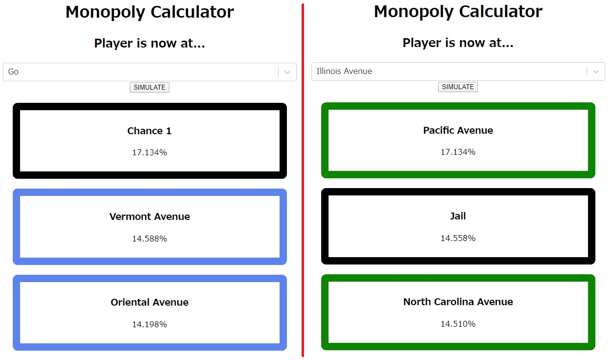
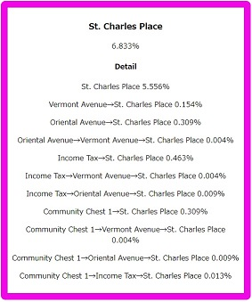

# Monopolycalc

This is a calculator which can __ONLY__ simulate the probabilities of landing the specific places on Monopoly, a famous board game. This program never simulates your dinner menu.

[MonopolyCalc](https://capra314cabra.github.io/monopolycalc/)

## Usage

Jump to the [page](https://capra314cabra.github.io/monopolycalc/), select your place and push the "SIMULATE" button. After that, you will see the list of probabilities which are sorted.

If you are the kind of experts, you may want to know what the odds of you landing Illinois and Boardwalk in a row. In fact, we have a function to watch them.  
You can watch more information by clicking the name of the place like follows.  
It may be too long to read...

## Simulation

This program doesn't simulate all of the games so there are things which is not considered on this app.  
Here is a featured list of it.

### Considerd things

- Throwing a double, the player gets one more chance to roll.
- Throwing a double for three times, the player is jailed.

### NOT Considered things

- The movement by Chance and Community Chest (Wait a release!)

## Author

[capra314cabra](https://github.com/capra314cabra)
